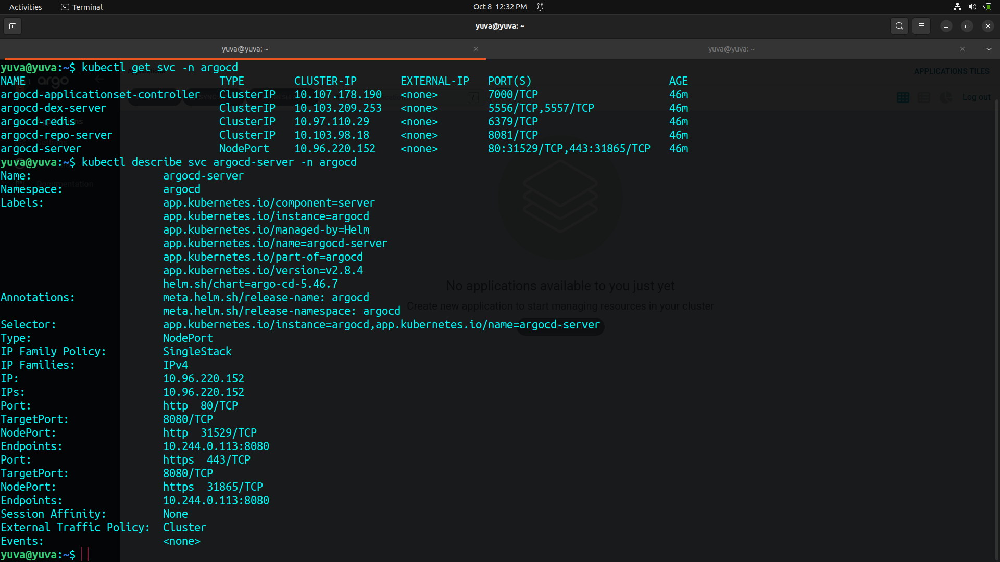
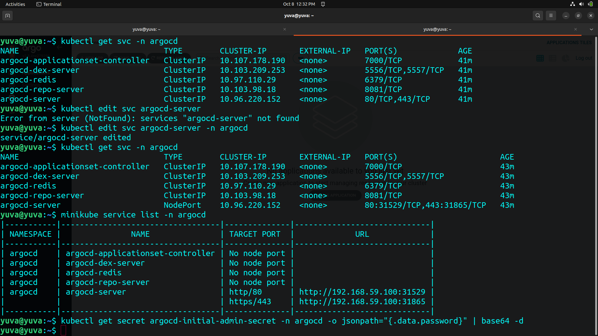
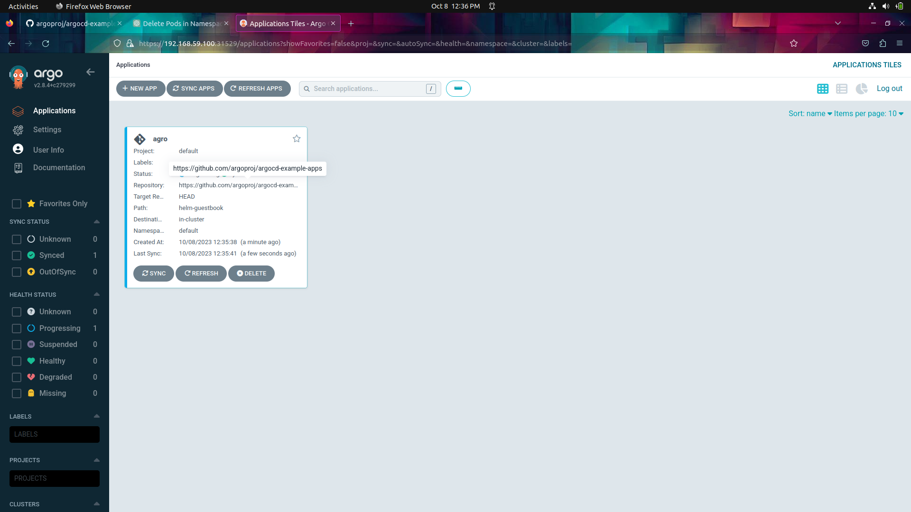
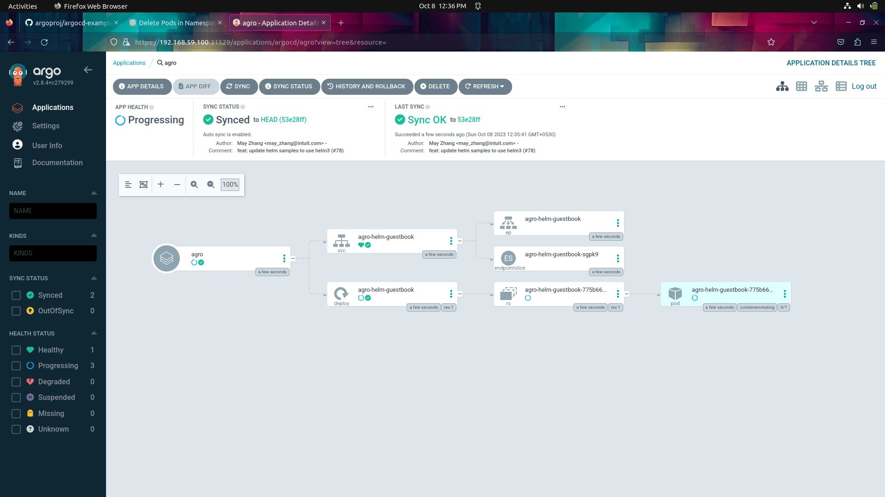

# To install ArgoCD in another namespace using Helm (the package manager for Kubernetes), you can follow these steps:
----

1. **Add the ArgoCD Helm Repository**: First, you need to add the ArgoCD Helm repository to your Helm CLI. This allows you to fetch the ArgoCD Helm chart from their repository.

   ```bash
   helm repo add argo https://argoproj.github.io/argo-helm
   ```

2. **Create a Namespace**: If the namespace where you want to install ArgoCD doesn't exist, create it using `kubectl`:

   ```bash
   kubectl create namespace <argocd-namespace>
   ```

   Replace `argocd-namespace` with your desired namespace name.

3. **Install ArgoCD Helm Chart**: Install the ArgoCD Helm chart into the desired namespace using Helm. Be sure to specify the namespace using the `--namespace` flag:

   ```bash
   helm install argocd argo/argo-cd --namespace <argocd-namespace>
   ```

   This command installs ArgoCD into the `argocd-namespace`.

4. **Access ArgoCD UI**: By default, ArgoCD deploys a LoadBalancer service to expose its UI. Depending on your Kubernetes cluster configuration, you might need to wait for the LoadBalancer to obtain an external IP address. You can check the service's status using:

   ```bash
   kubectl get svc -n <argocd-namespace>
   ```

   Once the external IP address is available, you can access the ArgoCD UI via a web browser using the IP address and port 80.
   

   **Note**: If you're using a local or non-cloud Kubernetes cluster, you might need to use a different method to access the UI, such as port-forwarding, NodePort, or an ingress controller.

5. **Login to ArgoCD**: After accessing the ArgoCD UI, you will be prompted to log in. You can log in using the default admin username and password:

   - Username: `admin`
   - Password: Retrieve the password using:

     ```bash
     kubectl get secret argocd-initial-admin-secret -n <argocd-namespace> -o jsonpath="{.data.password}" | base64 -d
     ```

   Copy the password and use it to log in.

6. **Deploy Applications**: You can now use the ArgoCD UI or ArgoCD CLI to deploy and manage applications within the `argocd-namespace`.


----



This installation method utilizes Helm to simplify the deployment process for ArgoCD in a specified namespace. Make sure to adjust namespace names and configurations according to your specific requirements.


----
