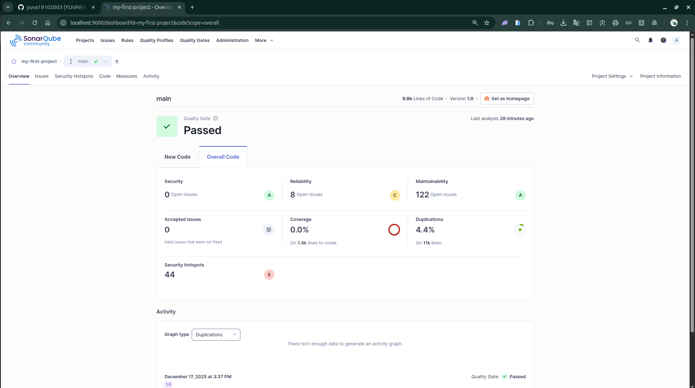

## What is SonarQube? (Quick context)

**SonarQube** is a **Static Application Security Testing (SAST)** and **code quality** platform.



It detects:

* Bugs 🐞
* Vulnerabilities 🔐
* Code smells 🧹
* Security hotspots
* Technical debt

Used in:

* CI/CD pipelines
* Pull request checks
* Code review automation

---

## SonarQube Architecture (Simple)

```
Developer Code
     ↓
Sonar Scanner
     ↓
SonarQube Server
     ↓
Dashboard / Quality Gate
```

Components:

* **SonarQube Server** – UI + rules engine
* **Database** – PostgreSQL (recommended)
* **Sonar Scanner** – CLI / CI tool

---

# PART 1 — Local SonarQube Setup (Docker)

### 1️⃣ Prerequisites

* Docker
* Docker Compose
* 4 GB RAM minimum

---

### 2️⃣ Docker Compose (Production-like)

```yaml
version: "3.8"

services:
  sonarqube:
    image: sonarqube:lts
    container_name: sonarqube
    depends_on:
      - db
    ports:
      - "9000:9000"
    environment:
      SONAR_JDBC_URL: jdbc:postgresql://db:5432/sonar
      SONAR_JDBC_USERNAME: sonar
      SONAR_JDBC_PASSWORD: sonar
    volumes:
      - sonarqube_data:/opt/sonarqube/data
      - sonarqube_extensions:/opt/sonarqube/extensions
      - sonarqube_logs:/opt/sonarqube/logs

  db:
    image: postgres:15
    container_name: sonar-db
    environment:
      POSTGRES_USER: sonar
      POSTGRES_PASSWORD: sonar
      POSTGRES_DB: sonar
    volumes:
      - postgresql:/var/lib/postgresql
      - postgresql_data:/var/lib/postgresql/data

volumes:
  sonarqube_data:
  sonarqube_extensions:
  sonarqube_logs:
  postgresql:
  postgresql_data:
```

Start:

```bash
docker compose up -d
```

Access:

```
http://localhost:9000
```

---

### 3️⃣ First Login

```
Username: admin
Password: admin
```

→ Change password immediately.

---

# PART 2 — Create Project & Token


### Steps:

1. **Create Project**
2. Choose **Manually**
3. Project Key: `my-node-app`
4. Generate **Token**
5. Save token (used by scanner)

---

# PART 3 — Scan Code Locally

## Option A — Sonar Scanner CLI (Recommended)

### 1️⃣ Install Scanner

```bash
wget https://binaries.sonarsource.com/Distribution/sonar-scanner-cli/sonar-scanner-cli-5.0.1.3006-linux.zip
unzip sonar-scanner-cli-*.zip
sudo mv sonar-scanner-* /opt/sonar-scanner
export PATH=$PATH:/opt/sonar-scanner/bin
```

---

### 2️⃣ Add `sonar-project.properties`

```properties
sonar.projectKey=my-node-app
sonar.projectName=My Node App
sonar.projectVersion=1.0

sonar.sources=.
sonar.language=js
sonar.sourceEncoding=UTF-8

sonar.exclusions=node_modules/**,dist/**
sonar.javascript.lcov.reportPaths=coverage/lcov.info
```

---

### 3️⃣ Run Scan

```bash
sonar-scanner \
  -Dsonar.host.url=http://localhost:9000 \
  -Dsonar.login=YOUR_TOKEN
```

✅ Results appear in dashboard.

---

## Option B — Scan Using Docker (Cleaner)

```bash
docker run --rm \
  -e SONAR_HOST_URL="http://host.docker.internal:9000" \
  -e SONAR_LOGIN="TOKEN" \
  -v "$(pwd):/usr/src" \
  sonarsource/sonar-scanner-cli
```

---

# PART 4 — Understanding the Dashboard


### Key Sections:

| Section           | Meaning                |
| ----------------- | ---------------------- |
| Bugs              | Runtime errors         |
| Vulnerabilities   | Security risks         |
| Code Smells       | Maintainability issues |
| Security Hotspots | Needs manual review    |
| Coverage          | Unit test coverage     |
| Duplication       | Repeated code          |

---

# PART 5 — Quality Gates (Very Important)

### Default Quality Gate Rules

❌ Build FAILS if:

* New bugs > 0
* New vulnerabilities > 0
* Coverage < 80%
* Code smells exceed threshold

### Custom Quality Gate

```
Administration → Quality Gates → Create
```

Common production rule:

```
✔ No new critical vulnerabilities
✔ Coverage > 70%
✔ No blocker issues
```

---

# PART 6 — CI/CD Integration

## GitHub Actions Example (Node.js)


```yaml
name: SonarQube Scan

on:
  push:
    branches: [main, develop]
  pull_request:

jobs:
  sonar:
    runs-on: ubuntu-latest

    steps:
      - uses: actions/checkout@v4

      - uses: actions/setup-node@v4
        with:
          node-version: 18

      - run: npm install
      - run: npm test -- --coverage || true

      - name: SonarQube Scan
        uses: SonarSource/sonarqube-scan-action@v2
        env:
          SONAR_TOKEN: ${{ secrets.SONAR_TOKEN }}
          SONAR_HOST_URL: ${{ secrets.SONAR_HOST_URL }}
```

Secrets:

```
SONAR_TOKEN
SONAR_HOST_URL=https://sonar.company.com
```

---

## Block Deployment if Quality Gate Fails

```yaml
- name: Quality Gate
  uses: SonarSource/sonarqube-quality-gate-action@v1
  timeout-minutes: 5
  env:
    SONAR_TOKEN: ${{ secrets.SONAR_TOKEN }}
```

---

# PART 7 — Language Support (Backend Focus)

| Language        | Support |
| --------------- | ------- |
| Java            | ⭐⭐⭐⭐⭐   |
| JavaScript / TS | ⭐⭐⭐⭐⭐   |
| Go              | ⭐⭐⭐⭐    |
| Python          | ⭐⭐⭐⭐    |
| PHP             | ⭐⭐⭐⭐    |
| C / C++         | ⭐⭐⭐     |
| Kotlin          | ⭐⭐⭐⭐    |

---

# PART 8 — SonarQube vs SCA vs DAST

| Tool            | Purpose                              |
| --------------- | ------------------------------------ |
| SonarQube       | **SAST** (code quality + security)   |
| Snyk / OWASP DC | **SCA** (dependency vulnerabilities) |
| OWASP ZAP       | **DAST** (runtime attacks)           |

👉 Best practice: **SAST + SCA + DAST**

---

# PART 9 — Production Best Practices

✅ Use **LTS version**
✅ PostgreSQL only
✅ Run behind **Nginx + HTTPS**
✅ Daily DB backups
✅ Integrate with CI, not manual scans
✅ Enforce Quality Gate before deploy

---

# PART 10 — Real-World DevOps Flow

```
Code Commit
   ↓
CI Build
   ↓
SonarQube Scan
   ↓
Quality Gate
   ↓
Deploy (only if PASS)
```

---

